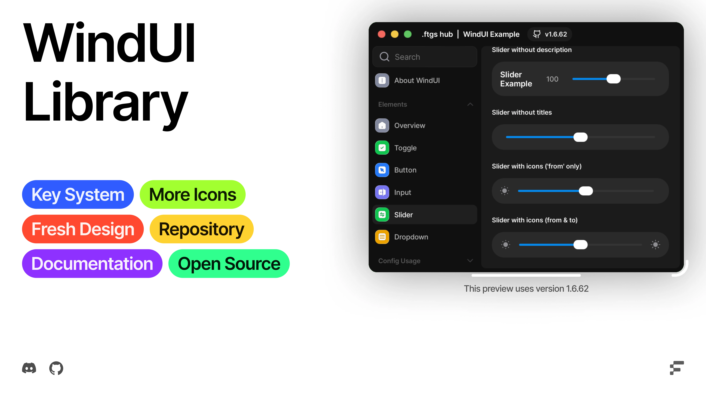

<!--<h1 align="center">WindUI</h1> -->

<!--
<picture>
    <source srcset="docs/banner-dark.webp" media="(prefers-color-scheme: dark)">
    <source srcset="docs/banner-light.webp" media="(prefers-color-scheme: light)">
    
</picture>-->


[](https://uibin.orqan.xyz/library/341a345c-b3c9-42fe-a45c-eb296580ce61)

> [!WARNING]
> This WindUI was not inspired by, and the name has nothing to do with UI Frameworks

> [!WARNING]
> WindUI is currently in Beta.
> This project is still under active development. Bugs, issues, and unstable features may occur. We’re constantly working on improvements, so please be patient and report any problems you encounter.

## Credits

#### Icons (https://github.com/Footagesus/Icons)

- [Lucide-Icons](https://github.com/lucide-icons/lucide)
- [Craft Icons](https://www.figma.com/community/file/1415718327120418204)
- [Geist Icons](https://vercel.com/geist/icons)
- [Solar Icons](https://icones.js.org/collection/solar)
- [SF Symbols](https://sf-symbols-one.vercel.app/)

### Links

- [Discord Server](https://discord.gg/ftgs-development-hub-1300692552005189632)
- [Documentation](https://footagesus.github.io/treehub-web/docs/windui)
- [Installation](https://footagesus.github.io/WindUI-Docs/docs/installation)
- [Example](/main_example.lua) (wip)
    ```luau
    loadstring(game:HttpGet('https://raw.githubusercontent.com/Footagesus/WindUI/refs/heads/main/main_example.lua'))()
    ```
